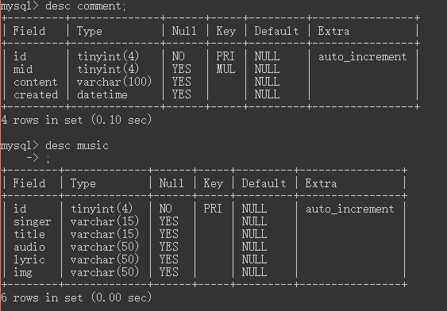

## 音乐在线播放器

> 本项目由 Apache + MySQL + PHP + JQuery + Ajax 搭建的一个小案例。

本案例有三个视图

1. 音乐列表
2. 音乐歌词及其进度、切换等控制
3. 音乐评论

> 注意：歌词文件可能各有异同，本项目里的处理也并非为标准的格式，因此还需要自行处理。

> 项目的数据库有两个 Tables，即 comment 和 music，其结构如下图。

